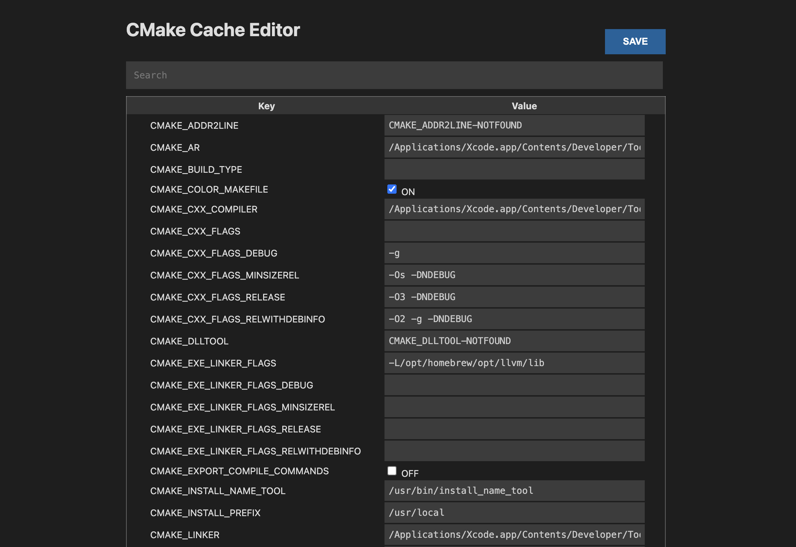

# Cache in CMake

## CMake Cache: A Quick Overview

- CMake uses a cache system to store configuration options and variables.
- This cache is typically stored in a file named `CMakeCache.txt` in the build directory.
- When you configure a CMake project, CMake reads the cache file to determine the values of various options and variables.

---

## Modifying Cache Values for Faster Builds

One of the advantages of using the CMake cache is that you can modify the cache values to avoid reconfiguring the entire project. This can significantly reduce build times, especially for large projects.

Here's a common scenario:

1. **Modify a Cache Variable:**
   - Open the `CMakeCache.txt` file in the build directory.
   - Find the variable you want to modify and change its value.
   - Save the file.

2. **Build the Project:**
   - Run the build command (e.g., `cmake --build .`)

CMake will use the modified cache values to build the project, skipping unnecessary steps like re-generating the build system files. This can lead to significant time savings, particularly when making minor changes to build options or configurations.

---

## VSCode CMake cache editor

- Since `CMakeCache.txt` can become quite large, and some keys might also be modified.
- So, we can use `CMake Cache Editor` extension in VSCode.
- Just run `cmd + shift + p` and find `CMake Cache Editor (UI)`.

---

!!! warning "Important Considerations"

     - **Cache Invalidation:** Be aware that certain changes to the source code or CMake configuration files might invalidate the cache, requiring a full reconfiguration.
     - **Complex Projects:** For complex projects with many dependencies and custom build systems, the benefits of modifying cache values might be less pronounced.
     - **Best Practices:** While modifying the cache can be a useful technique, it's generally recommended to use CMake's built-in mechanisms for configuring and building projects. This ensures consistency and reproducibility.

By understanding the CMake cache and its role in the build process, you can optimize your build times and improve your development workflow.
